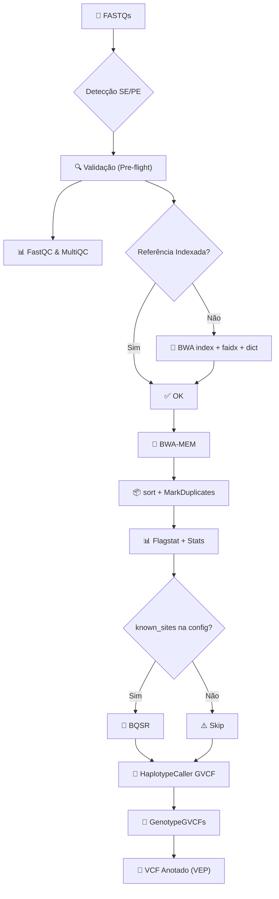

# Pipeline de Variantes Germinativas v2.0

Pipeline de bioinformática profissional para chamada de variantes germinativas, seguindo as **Best Practices do GATK4**. Transforma dados brutos de sequenciamento (FASTQ) em variantes anotadas (VCF), com rastreabilidade completa, processamento paralelo e suporte a Docker.

Este manual foi desenhado para bioinformatas, sendo direto ao ponto com os comandos básicos em Linux (Ubuntu/CentOS ou WSL) para que você possa executar análises reprodutíveis sem dificuldades.

---

## 📋 Índice

- [Tutorial Rápido: Passo a Passo (Quick Start)](#tutorial-rápido-passo-a-passo)
- [Arquitetura](#arquitetura)
- [Sincronização e Atualizações (GitHub)](#sincronização-e-atualizações-github)
- [Requisitos](#requisitos)
- [Instalação Detalhada](#instalação)
- [Configuração](#configuração)
- [Execução Completa (Comandos)](#execução)
- [Detecção Automática de Amostras](#detecção-automática-de-amostras)
- [Etapas do Pipeline](#etapas-do-pipeline)
- [Testes e Validação](#testes)
- [Troubleshooting](#troubleshooting)

---

## 🚀 Tutorial Rápido: Passo a Passo

Siga estas etapas para rodar sua primeira análise a partir do zero no terminal Linux/WSL:

### 1. Preparação Inicial
Baixe o repositório e ative o ambiente isolado (para que as ferramentas não deem conflito com seu sistema):
```bash
# Baixar o código
git clone https://github.com/seu-usuario/Pipeline-de-variantes-2.0.git
cd Pipeline-de-variantes-2.0

# Criar o ambiente Conda com todas as dependências do pipeline
conda env create -f environment.yaml

# Ativar o ambiente (execute sempre que abrir um terminal novo)
conda activate pipeline-variantes
```

### 2. Preparação de Dados
O pipeline espera que você adicione as referências genômicas e as suas amostras (FASTQ) em diretórios padrão.

```bash
# 1. Coloque o arquivo de referência FASTA na pasta references:
# Ex: copie seu hg38.fa para references/hg38.fa
cp /caminho/do/seu/hg38.fa references/

# 2. (Opcional) Copie também o VCF de SNPs conhecidos caso queira o BQSR ativado:
cp /caminho/dbSNP.vcf.gz references/

# 3. Coloque seus dados brutos de sequenciamento na pasta samples:
# O pipeline detecta automaticamente reads single-end ou paired-end.
cp /caminho/Amostra1_R1.fastq.gz samples/
cp /caminho/Amostra1_R2.fastq.gz samples/
```

### 3. Execução
Você pode usar a interface interativa (script Bash) ou executar manualmente o comando base.

**Opção A: Menu Interativo (Mais amigável)**
```bash
./run_pipeline.sh
# Digite '1' e Enter para Executar o pipeline completo
```

**Opção B: Via Linha de Comando Direta (Melhor para servidores)**
```bash
# Executar o pipeline em modo seco para validar configurações e ver a lista de tarefas (Dry-run)
snakemake -n

# Executar o pipeline valendo, utilizando até 8 núcleos de CPU
snakemake --cores 8
```

Ao final, os seus arquivos `BAM`, `VCF` final (Genótipo) e relatórios estarão organizados na pasta `results/`. Um banco de dados `database/pipeline.db` terá guardado o relatório completo da corrida (versões do GATK, logs e checksums dos FASTQs) para rastreabilidade de compliance.

---

## 🔄 Sincronização e Atualizações (GitHub)

Para facilitar a vida de pesquisadores e analistas, incluímos scripts Bash prontos na raiz do projeto para empurrar modificações de código para o Github ou puxar atualizações do time, sem precisar lembrar de comandos do git.

**Atualizar o repositório local com novidades (Pull):**
```bash
# Caso um colega tenha subido novas regras ou correções, basta puxá-las:
bash git_pull.sh
```

**Enviar suas modificações (Push):**
```bash
# Fez mudanças no pipeline e quer salvar no Github?
bash git_push.sh "Adicionando nova regra para MultiQC"
```

---

## 🏗 Arquitetura

O pipeline é orquestrado pelo **Snakemake**, que gerencia automaticamente dependências entre etapas, paralelismo e retomada de falhas (resume).



* **SQLite Nativo:** Registra timestamps, versões OS/Ferramentas e tempos.
* **Preflight Runner:** Checa espaço em disco, checksums, extensões e caminhos de referências antes de iniciar o pesado GATK.
* **GVCF Nativo:** Facilita coortes joint-calling no futuro sem realinhamentos.

---

## 🛠 Requisitos

### Sistema Operacional
- **Linux** (Ubuntu 20.04+, CentOS 7+) ou **Windows** via **WSL2**
- Python 3.10+
- 8 GB RAM mínimo (16 GB recomendado para genomas completos - WGS)

### Ferramentas de Bioinformática Embutidas
(Geralmente instaladas via `environment.yaml` com Conda)
- BWA (0.7.17)
- Samtools (1.17)
- GATK4 (4.4)
- FastQC & MultiQC
- Ensembl VEP (Opcional - para anotação funcional)
- Snakemake (8.0+)

---

## ⚙️ Configuração

Toda a configuração ocorre num arquivo legível: `config/config.yaml`. Não altere scripts `.smk` se quiser apenas trocar caminhos.

```yaml
reference:
  genome: "references/hg38.fa"
  name: "GRCh38"
  # Remova a linha abaixo caso não tenha um dbSNP para fazer BQSR
  known_sites:
    - "references/dbsnp_146.hg38.vcf.gz"

resources:
  threads: 8
  memory_mb: 16000
```
Você também pode sobrescrever as configs na própria linha de comando, ótimo para automação e LIMS:
```bash
snakemake --cores 8 --config resources__threads=16 reference__genome="ref/hg19.fa"
```

---

## 💻 Execução (Comandos Detalhados)

Para analistas mais experientes, o Snakemake permite execuções granulares (step-by-step):

```bash
# 1. Ver tarefas que seriam executadas (Simulação)
snakemake -n

# 2. Executar APENAS o mapeamento e indexação de referências
snakemake --cores 4 --until bwa_index samtools_faidx gatk_dict

# 3. Executar APENAS alinhamento
snakemake --cores 8 --until samtools_flagstat

# 4. Forçar continuação mesmo que alguma amostra falhe (ideal p/ muitas amostras)
snakemake --cores 8 --keep-going

# 5. Desbloquear diretório travado por queda de energia ou encerramento brusco
snakemake --unlock
```

---

## 🔬 Etapas do Pipeline Detalhadas

1. **Reference (Indexação)**: 
   Verifica automaticamente e indexa `.fai`, `.dict` e `.bwt` sem você se preocupar caso forneça um `.fa` puro.
2. **Quality (QC)**: 
   Gera HTMLs com o FastQC de forma crua das bibliotecas originais.
3. **Alignment**: 
   Roda `BWA-MEM` com pipe em memória para o `samtools sort`, mitigando I/O pesado de HD. Em seguida, remove duplicatas.
4. **Caller**: 
   Caso informe o `known_sites`, ele faz recalibração. Extrai VCF base via *HaplotypeCaller*.
5. **Annotator**: 
   (Opcional) Executa VEP se ativado na configuração.

---

## 🧪 Testes e Validação

Nós possuímos a mais densa camada de testes unitários para proteger a infraestrutura local em novas implementações.
Para validar que nenhuma configuração local corrompeu a lógica central de extração:

```bash
# Rodar todos os testes de estabilidade, logging, banco de dados e simulação Snakemake:
pytest tests/ -v
```

---

## 🚑 Troubleshooting (Resolução de Problemas)

### "Nenhuma amostra encontrada"
- Certifique-se de que seus FASTQs foram colados no caminho real de `samples/` e possuem extensões padrão (`_R1.fastq.gz` ou `.fq`).
- **Verificação rápida:** `ls -l samples/`

### "Espaço em disco insuficiente" reportado pelo Pre-flight
- O pipeline estima 10x do tamanho GZ de entrada. Se está em WSL no Windows, verifique se seu disco `C:` não encheu.

### Erro do VEP Cache (Annotator falhou)
- O Ensembl VEP pode necessitar cache baixado. Caso não o possua, edite `config.yaml` trocando a opção de anotação de variantes para desativada ou aponte a config de cache corretamente.

---

*Feito para fins demonstrativos, educacionais, não sendo permitido o uso comercial sem contato prévio*
