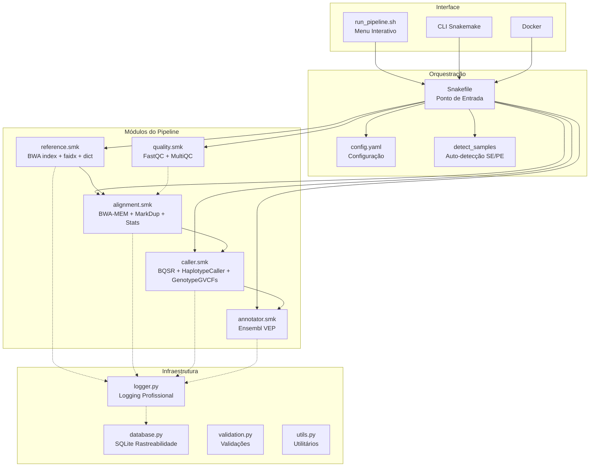
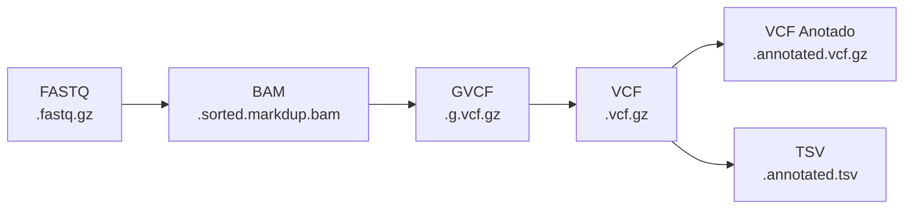

# Arquitetura do Pipeline

## Visão Geral

O pipeline segue uma arquitetura modular onde cada etapa bioinformática é encapsulada em um módulo Snakemake independente, com scripts Python auxiliares para funcionalidades transversais (logging, banco de dados, validação).

## Diagrama de Componentes



## Fluxo de Dados



## Decisões de Design

### Por que Snakemake?

1. **Python nativo**: A equipe já conhece Python
2. **Resume automático**: Só re-executa o que mudou (baseado em timestamps)
3. **Paralelismo declarativo**: Basta definir inputs/outputs — Snakemake resolve dependências
4. **Integração com ecossistema**: Docker, Singularity, Conda, Cloud (AWS, GCP, Azure)

### Por que GVCF?

O HaplotypeCaller em modo `-ERC GVCF` permite:
- Joint calling futuro sem reprocessar amostras
- GenotypeGVCFs individual quando há uma amostra só
- GenomicsDBImport + GenotypeGVCFs quando há múltiplas

### Por que BQSR condicional?

- BQSR requer `known_sites` (dbSNP, Mills & 1000G)
- Nem todos os ambientes têm esses arquivos disponíveis
- O pipeline funciona corretamente sem BQSR (com warning)
- Quando `known_sites` está configurado, BQSR é executado automaticamente

### Por que SQLite?

- Zero dependências externas (já vem com Python)
- Portátil (um único arquivo `.db`)
- SQL padrão para consultas
- Suficiente para rastreabilidade clínica

---

## Escalabilidade e Futuras Expansões

A arquitetura do pipeline foi desenhada em torno da modularidade e reprodutibilidade, facilitando a adoção de novas práticas.

### Padrão de Inserção de Novos Módulos

#### Adicionando Novos Callers (Somatic, CNV, SV)

Para adicionar novos callers de variantes (ex: Strelka2 para Somatic, Manta para SVs, GATK gCNV para CNVs), siga este fluxo:

1. Crie uma nova regra em `workflow/rules/` (ex: `workflow/rules/somatic_caller.smk`).
2. Defina os inputs dependendo dos outputs do alinhamento (geralmente BAM/CRAM já processado).
3. Atualize o dicionário de ferramentas no arquivo `config/config.yaml` sob a aba `tools` e não esqueça de gerenciar o novo ambiente (`workflow/envs/somatic.yaml`).
4. Importe o novo módulo no `Snakefile` principal (`include: "workflow/rules/somatic_caller.smk"`) caso o modo somático esteja ativado via configuração.

**Exemplo de configuração para alternar callers:**
```yaml
pipeline:
  mode: "somatic" # ou "germline"
  variant_caller: "mutect2" # ou "strelka2"
```

#### Integração com RNA-Seq

Para integrar análises de transcritômica (RNA-Seq):
* Crie um sub-workflow para a etapa de alinhamento com *splice-aware aligners* (ex: STAR).
* O `detect_samples` e `PreflightRunner` já são agnósticos em relação ao tipo biológico dos FASTQs, mas você pode parametrizar a verificação de índices do STAR na classe `ReferenceManager`.

### Escalabilidade da Infraestrutura (HPC e Nuvem)

O pipeline nativamente se beneficia do Snakemake para orquestração. Para escalar execações:

#### Clusters HPC (SLURM / PBS)

A execução em cluster não requer nenhuma modificação no código Python/Snakemake do projeto. 
Basta utilizar os **Snakemake Profiles**.

1. Instale o executor do slurm: `pip install snakemake-executor-plugin-slurm`.
2. Rode o pipeline apontando para o cluster:
```bash
snakemake --executor slurm --jobs 100 --default-resources slurm_account=meu_projeto slurm_partition=normal
```
O Snakemake automaticamente irá submeter um job SLURM (via `sbatch`) para cada regra (como BWA, GATK HaplotypeCaller) com os recursos especificados (threads, mem_mb).

#### Kubernetes e Cloud (AWS/GCP)

Similar ao SLURM, o Snakemake possui executores nativos para Kubernetes e Cloud (Google Life Sciences / AWS Batch).

* **Kubernetes:** `snakemake --executor kubernetes --jobs 50 --kubernetes-namespace pipeline-namespace`
* Requer que as ferramentas estejam conteinerizadas. Todos os módulos em `workflow/rules/` devem referenciar um contêiner através da diretiva `container: "docker://..."` (ou local `docker-compose.yml` providenciado em `docker/`).

### Integração de Sistemas (APIs e LIMS)

O `Snakefile` inclui hooks de eventos (`onstart`, `onsuccess`, `onerror`). Para conectar o pipeline a um LIMS (Laboratory Information Management System) ou notificar um sistema via API:

1. Modifique a seção `onsuccess` ou `onerror` no `Snakefile`.
2. Utilize scripts para fazer chamadas HTTP contendo o payload de status.
3. Utilize os relatórios JSON gerados (`results/execution_report.json`) para alimentar os bancos de dados clínicos sem precisar fazer parser direto nos logs.

**Exemplo (Snakefile):**
```python
onsuccess:
    import requests
    import json
    
    report_file = f"{RESULTS_DIR}/execution_report.json"
    with open(report_file) as f:
        data = json.load(f)
        
    requests.post(
        "https://api.meu-lims.com/v1/pipeline_callback",
        json={"run_id": data["pipeline"]["run_id"], "status": "COMPLETED"}
    )
```

### Rastreabilidade Estendida

Caso haja necessidade de adicionar mais validações no `PreflightRunner` (ex: verificar saldo de uso na nuvem ou validar se IDs das amostras existem no banco clínico), adicione novos métodos à classe `PreflightRunner` no arquivo `scripts/common/preflight.py` e registre-os na chamada `run_all()`. O banco `pipeline.db` já está preparado para aceitar múltiplos checks sem precisar refatorar as queries.
